# FraudSentinel

[](https://www.python.org)
[](LICENSE)
[](https://streamlit.io)
[](https://www.anthropic.com)

Agentic fraud detection platform. Compresses a 15-minute analyst investigation into a 30-second multi-agent pipeline — flags a transaction, attributes the score, retrieves similar historical patterns, and synthesizes an analyst-facing decision.

> **🚀 Live Demo**: **[srinayani123-fraudsentinel.hf.space](https://srinayani123-fraudsentinel.hf.space)**
> Sign in with Google · paste your Anthropic API key in Settings · pick a flagged transaction · click **Run investigation**

---

## What it does

**Investigate** flagged transactions through a 4-agent pipeline (Triage → Investigator with tool use → Pattern matching → Report) with SHAP attribution and LSTM timestep analysis woven between stages.
*Why it matters: analysts typically spend 5-15 minutes per case manually pulling context. This compresses it to 30 seconds while preserving — and surfacing — the reasoning.*

**Verify** retrieved patterns through a two-tier check — semantic retrieval finds candidates, a Pattern agent verifies indicator fit against actual feature values, and the system falls back to SHAP-grounded analysis when no pattern cleanly matches.
*Why it matters: most production RAG systems confuse lexical similarity with semantic relevance. This system refuses to pretend a pattern matches when it doesn't, which prevents the most common failure mode of analyst-facing AI.*

**Generate** production fraud rules from a filtered transaction set using a Planner + 4 parallel Workers + Synthesizer pipeline.
*Why it matters: after a fraud wave, the typical analyst → DS → engineering rule-writing cycle takes 2-3 days. This produces 4-8 ranked rules with production SQL, estimated catch / FPR, and tiered deployment recommendations in ~60 seconds.*

**Browse** 377 catalogued fraud archetypes across 13 categories with calibrated similarity matching.
*Why it matters: the pattern library is the institutional memory layer — it makes the AI's verdicts traceable to a documented archetype rather than producing opaque "trust me" outputs.*

**Bring your own Anthropic key** — visitors paste their key in Settings; key lives only in the browser session and is never persisted.
*Why it matters: the demo can serve unlimited traffic at zero infra cost, and visitors keep exact control over their own API spend.*

---

## Methodology

### Investigation pipeline (one transaction → multi-agent decision)

```
Triage           [Haiku 4.5]      — risk routing JSON in <1s
   ↓
Score Attribution [Deterministic] — SHAP TreeExplainer + LSTM per-timestep MSE
   ↓
Investigator     [Sonnet 4.5]     — multi-turn tool use, gathers evidence
   ↓
Pattern          [Haiku 4.5]      — three-tier fit verdict (Strong / Partial / No fit)
   ↓
Report           [Sonnet 4.5]     — analyst-facing decision summary, streamed
```

Each agent receives the previous stage's output **plus ground-truth model attributions** (SHAP for XGBoost, per-timestep reconstruction error for the LSTM autoencoder) so it cites real numbers instead of speculating. Per-stage model selection — Haiku for bounded structured outputs, Sonnet for tool use and analyst-facing prose — keeps wall-clock latency at ~30s while preserving reasoning quality.

### Two-tier pattern verification

1. **Tier 1** — ChromaDB cosine retrieval surfaces top candidates from 377 patterns
2. **Tier 2** — Pattern agent reads each candidate's indicator thresholds against actual transaction features and decides Strong fit / Partial fit / No fit

When Tier 2 rejects all candidates, the system falls back to a **SHAP-grounded checklist** built from the model's actual top drivers — preventing the lexical-similarity-confused-with-semantic-relevance failure that plagues most production RAG.

### Rule generator pipeline (many transactions → production rules)

```
Aggregates       [Pandas, 100ms]  — fraud-vs-legit distributional contrast
   ↓
Planner          [Sonnet 4.5]     — dispatches workers, writes focused briefs
   ↓
4 Workers        [Sonnet 4.5, parallel via ThreadPoolExecutor]
                                  — Velocity / Email / Device / Amount
   ↓
Synthesizer      [Sonnet 4.5]     — ranks rules, deduplicates, recommends deployment
```

Output: ranked rules with **plain English + production SQL + estimated catch rate + estimated FPR + rationale + evidence**. ~60s end-to-end via parallelism.

### SHAP-aware retrieval

The pattern query is built from the **SHAP attribution** — which fraud surface is the XGBoost model reading? If the top SHAP family is `device_identity`, the query emphasizes "device fingerprint anomaly". This routes engineered-anomaly, device-takeover, and credential-compromise patterns into the candidate pool when the model flags them, instead of always defaulting to velocity patterns.

### Hybrid OOD detection

A PCA + k-NN out-of-distribution detector calibrated against 752 auto-generated queries achieves **0% false-reject and 98% true-reject**, ensuring unrelated questions ("show me horoscope predictions") return nothing instead of confidently citing an irrelevant fraud pattern.

---

## Architecture

```
┌─────────────────────────────────────────────────────────────────┐
│                     STREAMLIT DASHBOARD                          │
│  Monitor  ·  Investigate  ·  Insights  ·  Pattern Library        │
└─────────┬───────────────────────────────────────────────────────┘
          ↓
┌─────────────────────────────────────────────────────────────────┐
│                     AGENTIC ORCHESTRATION                        │
│   Investigation pipeline    │   Rule Generator pipeline           │
│   (4 agents + 2 attribution)│   (Planner + 4 workers + synth)     │
└─────────┬───────────────────────────────────────────────────────┘
          ↓
┌─────────────────────────────────────────────────────────────────┐
│   ML LAYER          │   RETRIEVAL & VERIFICATION                 │
│   XGBoost · LSTM AE │   ChromaDB · 377 patterns · OOD detector   │
│   SHAP attribution  │   bge-base-en-v1.5 embeddings              │
└─────────┬───────────┴────────────────────────────────────────────┘
          ↓
┌─────────────────────────────────────────────────────────────────┐
│                     CLAUDE LLM (Anthropic, BYOK)                 │
│   Haiku 4.5 — bounded structured outputs                         │
│   Sonnet 4.5 — multi-turn tool use, analyst synthesis            │
└─────────────────────────────────────────────────────────────────┘
```

---

## File structure

```
fraudsentinel/
├── src/
│   ├── agentic/                  # Multi-agent pipelines
│   │   ├── orchestrator.py       # 4-agent investigation pipeline
│   │   ├── pattern_coach.py      # Indicator → checklist conversion
│   │   ├── shap_coach.py         # SHAP-grounded fallback checklist
│   │   ├── ood_detector.py       # PCA + k-NN OOD rejection
│   │   ├── tools.py              # Tool schemas for the Investigator
│   │   ├── investigation_cache.py# Two-tier cache (session + SQLite)
│   │   └── rule_generator/       # Planner + parallel workers + synthesizer
│   ├── dashboard/                # Streamlit UI
│   │   ├── byok.py               # Bring-Your-Own-Key gate + helpers
│   │   ├── auth.py               # Supabase + Google OAuth
│   │   └── pages/                # Monitor · Investigate · Insights · Pattern Library · Settings
│   ├── ml_models/                # XGBoost training + SHAP attribution
│   ├── dl_models/                # LSTM autoencoder
│   ├── api/                      # FastAPI service
│   └── utils/                    # Config, logging
├── data/
│   ├── samples/                  # Demo transactions (10K rows)
│   └── fraud_cases/              # 377-pattern archetype library (JSON)
├── models/                       # Trained artifacts + ChromaDB
├── notebooks/                    # Training + evaluation notebooks
├── Dockerfile                    # HF Spaces deployment
├── requirements.txt              # Local dev deps
└── requirements-hf.txt           # Production deps (pinned)
```

---

## Metrics

### Models

| Model | Metric | Score |
|---|---|---|
| XGBoost | PR-AUC | **0.8553** |
| XGBoost | ROC-AUC | **0.9698** |
| XGBoost | Recall @ 1% FPR | **81.7%** |
| LSTM Autoencoder | Recall @ 5% FPR | 14.9% |

### Retrieval

| Metric | Value |
|---|---|
| Patterns indexed | **377** |
| Archetype categories | 13 |
| OOD true-reject rate | **98%** |
| OOD false-reject rate | **0%** |
| Calibration queries | 752 |

### Pipeline latency

| Pipeline | Latency |
|---|---|
| Investigation (cold) | ~30s |
| Investigation (cached) | <500ms |
| Rule generation | ~60s |

The 13 archetypes: account_takeover, bin_attack, card_testing, credential_compromise, device_takeover, email_risk, engineered_anomaly, friendly_fraud, geo_anomaly, subscription_probe, synthetic_identity, temporal_anomaly, velocity_attack.

---

## Tech stack

**ML**: XGBoost · PyTorch · SHAP · scikit-learn
**Agents**: Anthropic Claude (Sonnet 4.5 + Haiku 4.5) · direct SDK, no framework
**Retrieval**: ChromaDB · bge-base-en-v1.5 embeddings · PCA + k-NN OOD detector
**Frontend**: Streamlit · Plotly
**Auth**: Supabase · Google OAuth
**Backend**: FastAPI · Pydantic
**Deployment**: Docker · Hugging Face Spaces

### Why direct Anthropic SDK instead of LangChain / CrewAI / LangGraph

Frameworks add abstraction, hidden retry logic, and supervision-pattern overhead that hurts latency without adding reasoning quality. The pipeline does direct `client.messages.create()` calls with per-stage model selection, parallelizes where parallelism actually helps (Rule Generator workers via ThreadPoolExecutor), and chains where chaining is required. Net result: ~30-second investigations vs. the 90-180 second baseline of equivalent CrewAI tutorial pipelines.

---

## Commands

### Prerequisites
- Python 3.11
- An [Anthropic API key](https://console.anthropic.com)

### Install
```bash
git clone https://github.com/srinayani123/fraudsentinel.git
cd fraudsentinel

python -m venv .venv
source .venv/bin/activate          # Linux / macOS
.venv\Scripts\Activate.ps1         # Windows PowerShell

pip install -r requirements.txt
```

### Configure
```bash
cp .env.example .env
# Edit .env — minimum: ANTHROPIC_API_KEY (or skip and use BYOK in the UI)
```

### Run locally
```bash
streamlit run src/dashboard/app.py
```
Open [http://localhost:8501](http://localhost:8501) and sign in with Google.

### Train models from scratch (optional)
```bash
python -m src.ml_models.train_xgboost      # XGBoost classifier (PR-AUC 0.86)
python -m src.dl_models.train_lstm_ae      # LSTM autoencoder
python -m src.agentic.build_knowledge_base # Index 377 patterns into ChromaDB
```

### Run a single investigation programmatically
```bash
python -m src.agentic.investigate          # CLI interface to the 4-agent pipeline
```

---

## Screenshots


### Multi-agent investigation
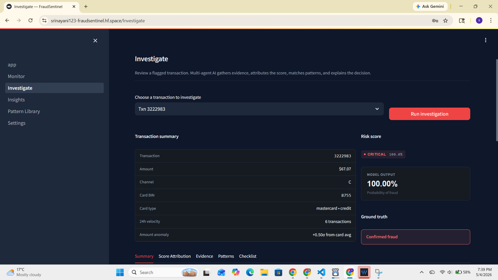

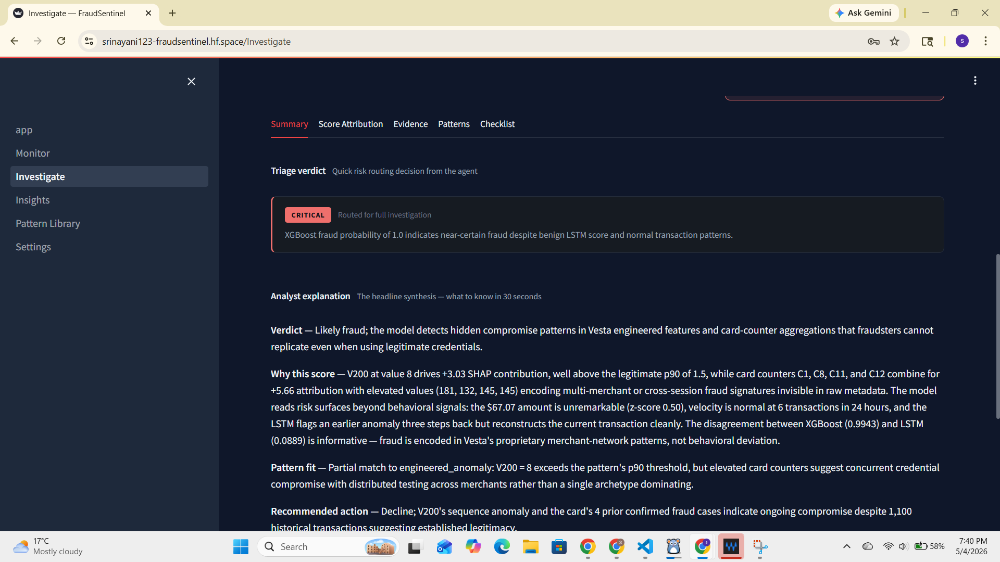

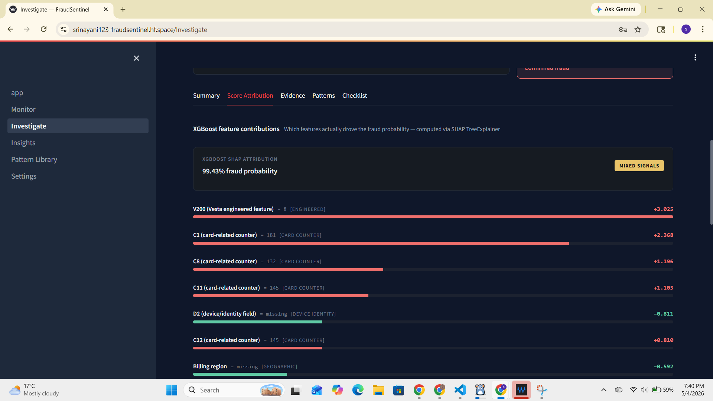

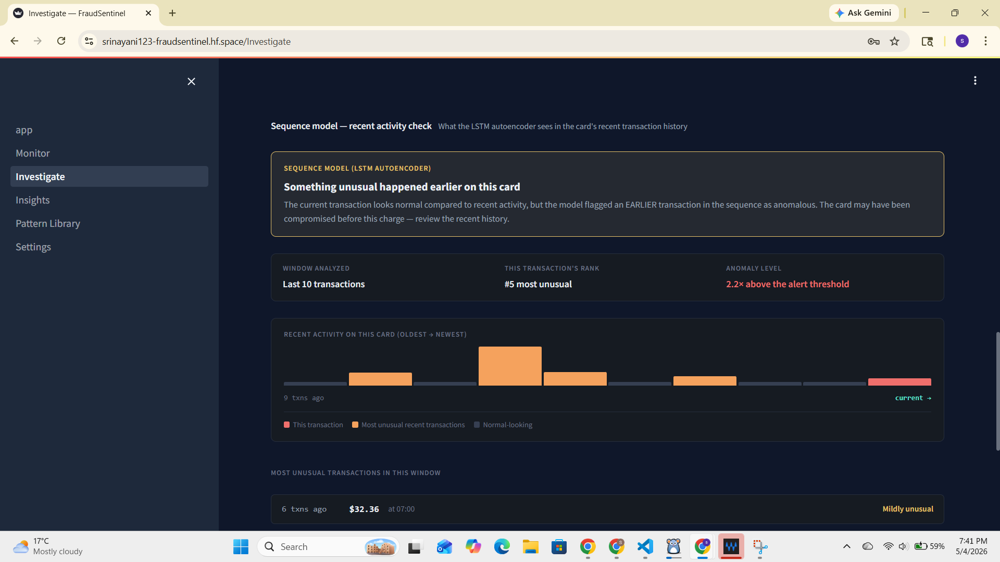

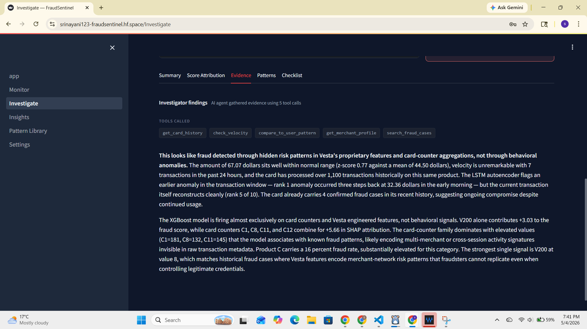

_Five-tab decision package: Summary · Score Attribution · Evidence · Patterns · Checklist_

### Two-tier pattern verification

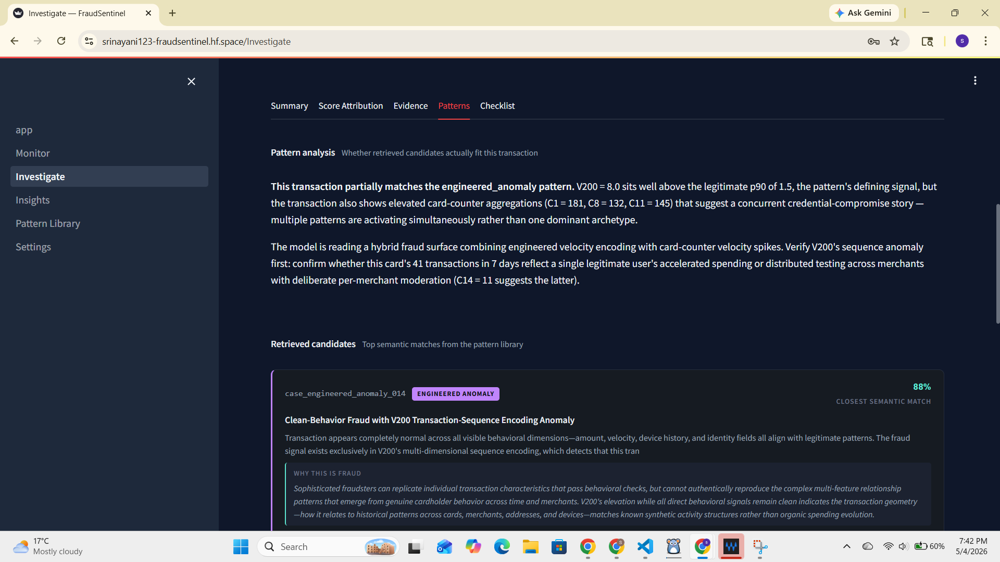

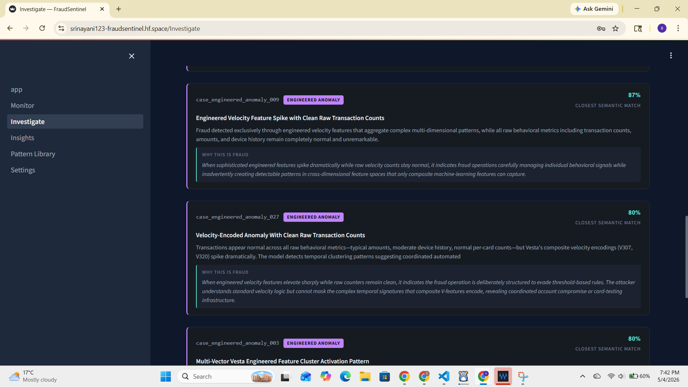

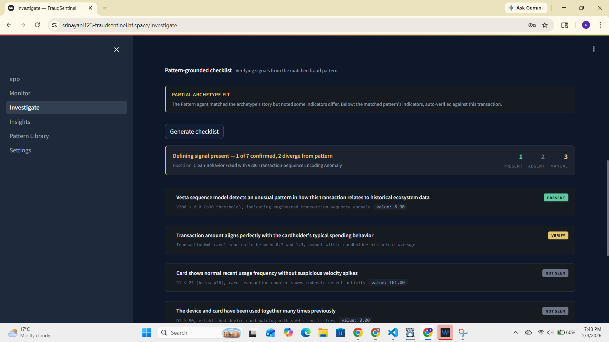

_Semantic retrieval surfaces candidates; Pattern agent verifies indicator fit and reports Strong / Partial / No fit_

### Rule generator

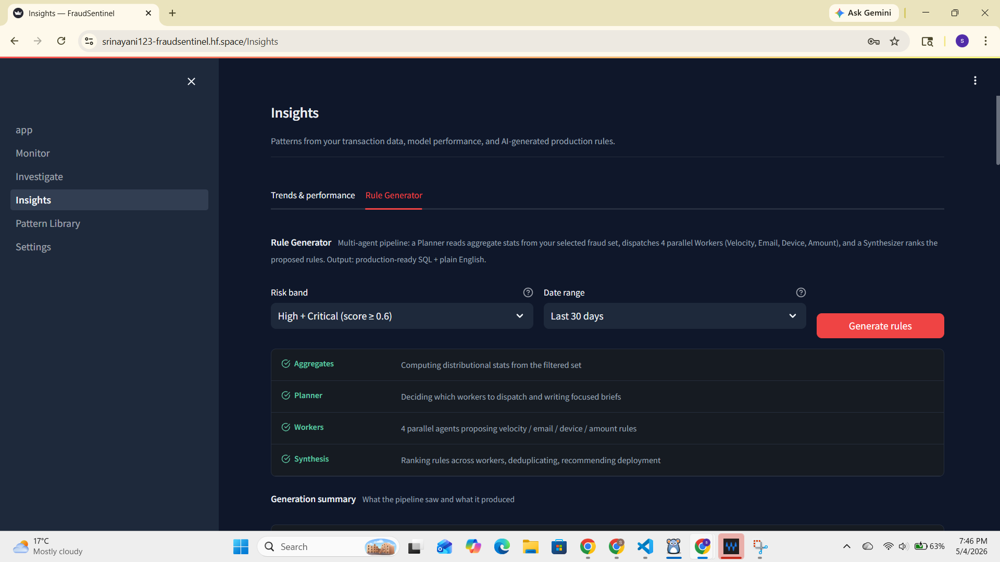

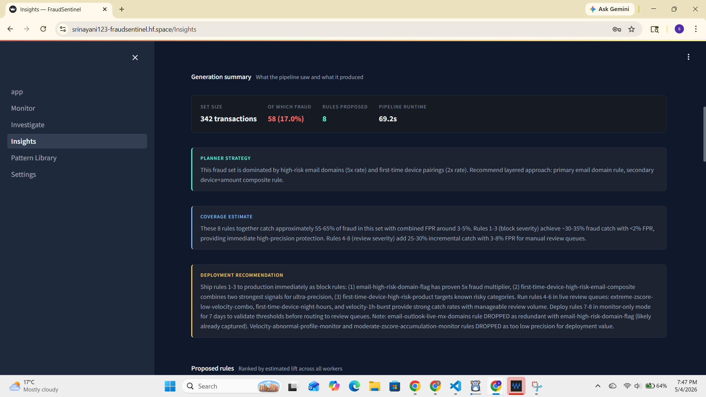

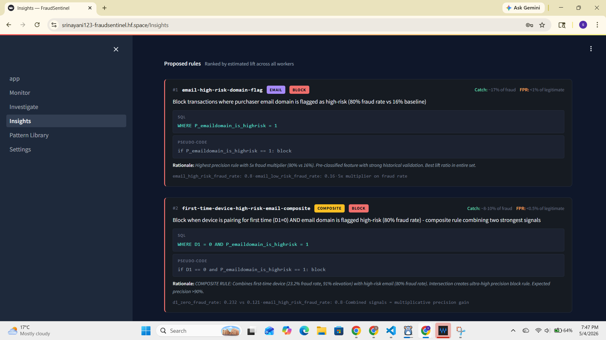

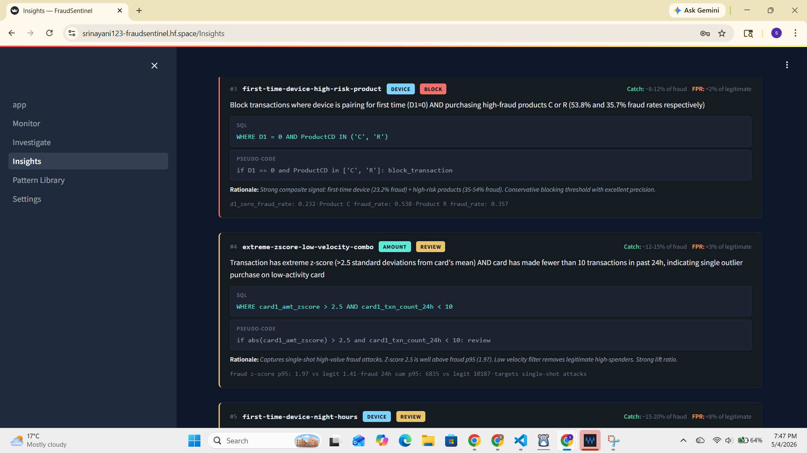

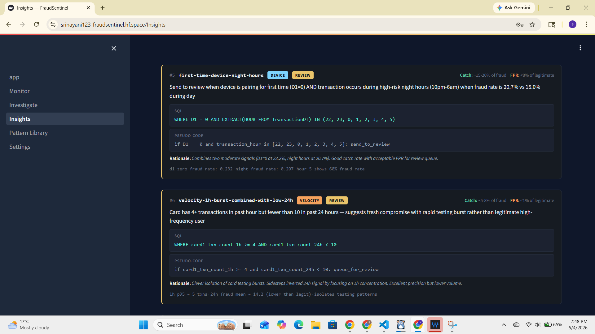

_Planner dispatches 4 parallel workers; Synthesizer ranks rules with SQL + estimated catch / FPR_

### Insights dashboard
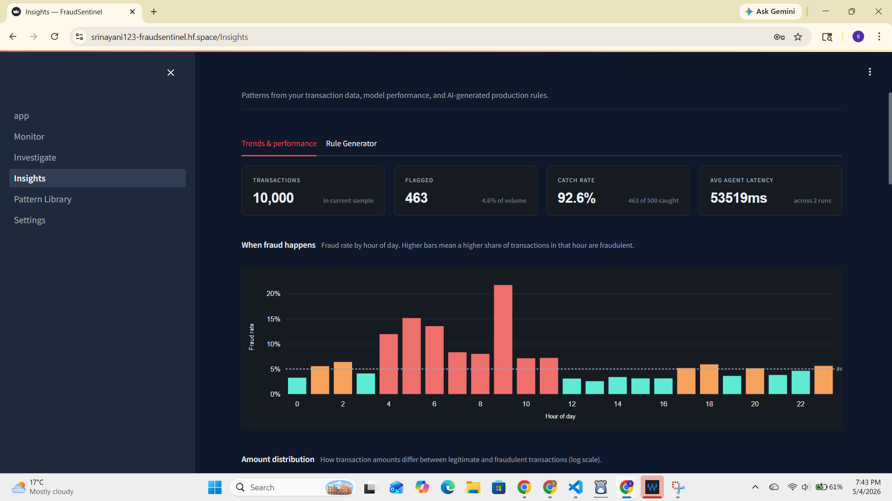

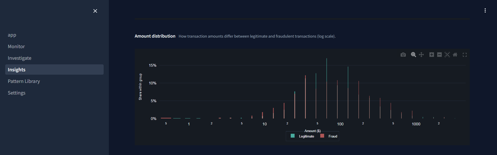

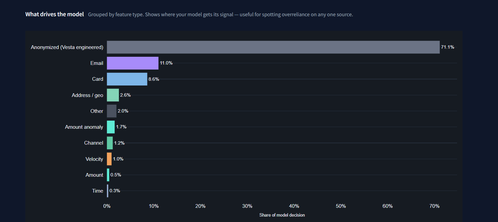

_Threshold tradeoff slider, hour-of-day fraud patterns, model confidence distribution_

### Pattern Library
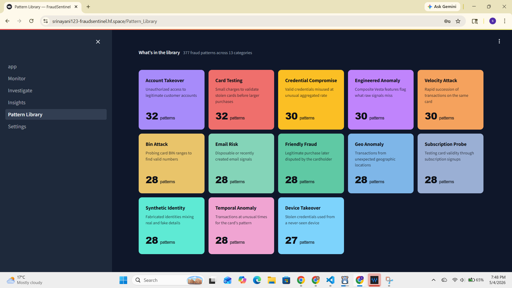

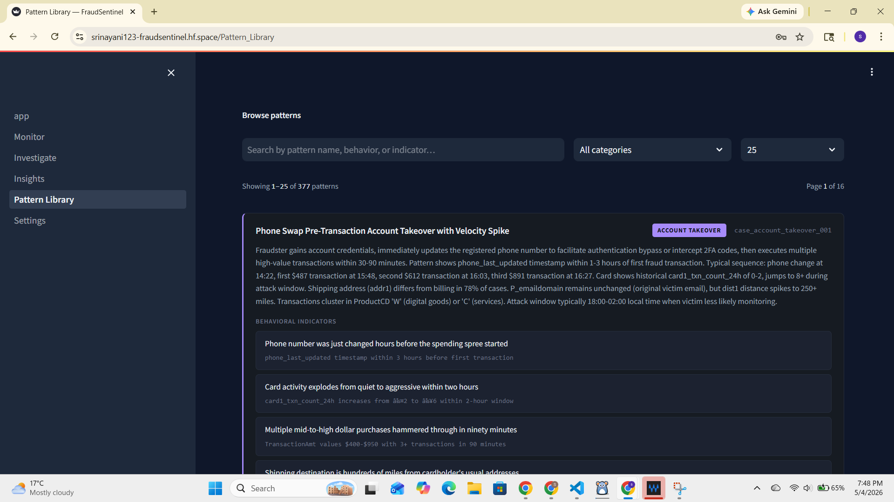

_377 catalogued archetypes across 13 categories, browseable by surface_

---

## Dataset

[IEEE-CIS Fraud Detection](https://www.kaggle.com/c/ieee-fraud-detection) — 590,540 transactions provided by Vesta Corporation, with engineered fraud features across card aggregations (C1-C14), device fingerprints (D1-D15), and Vesta-derived velocity encodings (V1-V300+). The pattern library was hand-curated to span 13 distinct fraud archetypes — from velocity attacks and card testing to engineered-feature anomalies and sophisticated device-takeover patterns.

---

## License

MIT — see [LICENSE](LICENSE).

---

<sub>Built with Anthropic Claude · Streamlit · ChromaDB · XGBoost · PyTorch · Hugging Face Spaces</sub>